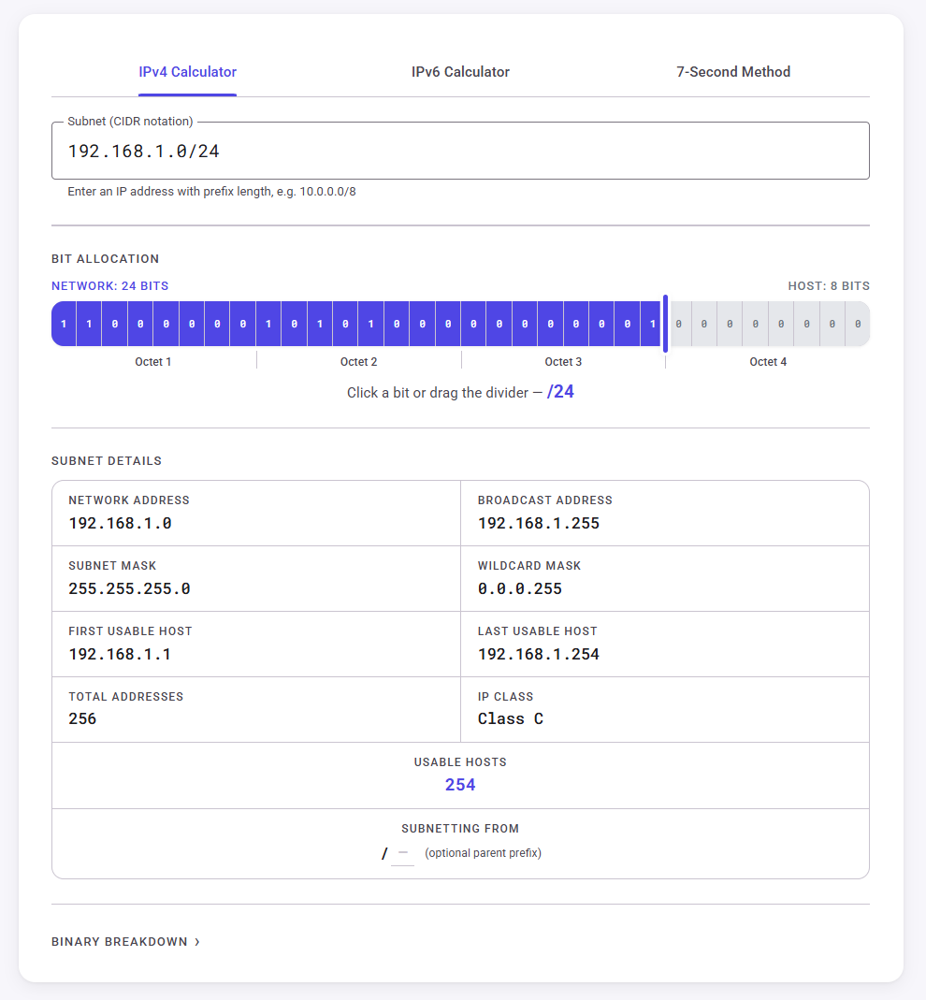

# Visual Subnet

A visual, interactive subnet calculator for IPv4 and IPv6.

**[github.com/andrewjamesmoore/visual-subnet](https://andrewjamesmoore.github.io/visual-subnet/)**

---

When I was studying for security+ and trying to wrap my head around subnetting I kept drawing out these graphs that split the bits between the network and hosts. Having a visual and interactive slider to see how adding and removing bits affects the IPs really helped it land for me. This calculator not only let's you enter in an IP but shows you what's happening — how bits are divided, where your address sits in the block, and what all the related values mean at a glance.

## Features

### IPv4 Calculator
Enter any IP address and prefix length to instantly see:
- Network address, broadcast address, subnet mask, and wildcard mask
- First and last usable hosts
- Total addresses and usable host count
- IP class
- A visual bit-allocation bar showing the network/host split
- Full binary representation of the address and mask

You can also enter a parent prefix to see how many subnets you're carving out of a larger block.

### IPv6 Calculator
The same visual approach applied to IPv6 — enter an address and prefix to see the prefix/interface ID split, address details, and binary breakdown.

### 7-Second Subnetting Method
An interactive guide to the mental math shortcut used for quickly calculating subnet boundaries without converting to binary — popularised by Professor Messer for networking exams and certifications. Enter an IP and prefix to see a step-by-step walkthrough alongside the full reference chart.

---

### Stack

Vanilla TS with Material UI web components and Jest for unit tests.

[github.com/andrewjamesmoore/visual-subnet](https://github.com/andrewjamesmoore/visual-subnet)
